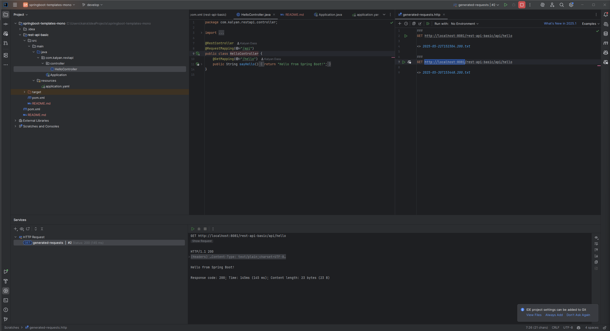

# REST API Basic Spring Boot Template

This template provides a minimal Spring Boot REST API setup, ideal for starting new microservices or backend applications.

## Features

- Spring Boot 3.x
- Simple REST controller (`/api/hello`)
- Customizable server port and context path
- Maven build with Java 24 support
- Example configuration with `application.yaml`
- Ready for Dockerization

## Project Structure

```
rest-api-basic/
├── pom.xml
├── README.md
├── src/
│   ├── main/
│   │   ├── java/
│   │   │   └── com/kalyan/restapi/
│   │   │       ├── Application.java
│   │   │       └── controller/
│   │   │           └── HelloController.java
│   │   └── resources/
│   │       └── application.yaml
│   └── test/
```

## Getting Started

### Prerequisites

- Java 24 or higher
- Maven 3.8+

### Build and Run

1. Build the project:

    ```sh
    ./mvnw clean install
    ```

2. Run the application:

    ```sh
    ./mvnw spring-boot:run
    ```

3. The API will be available at [http://localhost:8081/rest-api-basic/api/hello](http://localhost:8081/rest-api-basic/api/hello)

### Configuration

- Change server port or context path in `src/main/resources/application.yaml`:

    ```yaml
    server:
      port: 8081
      servlet:
        context-path: /rest-api-basic
    ```

### Testing

Run tests with:

```sh
./mvnw test
```

## Sample Run Response



## Customization

- Update package names and group/artifact IDs in `pom.xml` as needed.
- Add new controllers or services under `com.kalyan.restapi`.

## License

This template is licensed under the MIT License.
